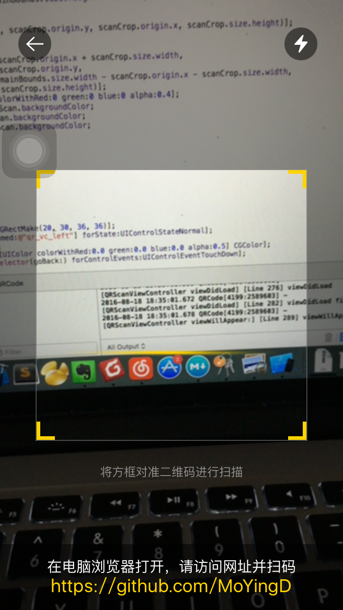

# QRCode
> 二维码扫描，包含扫描效果

--
### 使用
* 将 QRReader 文件夹添加至工程
* \#import "QRScanViewController.h"
* 复制下面的代码， [self openQRVC];

``` 
- (void)openQRVC
{
    QRScanViewController *vc = [[QRScanViewController alloc] init];
    [self presentPostPage:vc];
}

- (void)presentPostPage:(UIViewController *)postPage
{
    UINavigationController *nc = [[UINavigationController alloc] initWithRootViewController:postPage];
    [self presentViewController:nc animated:YES completion:nil];
}

```

### 界面



